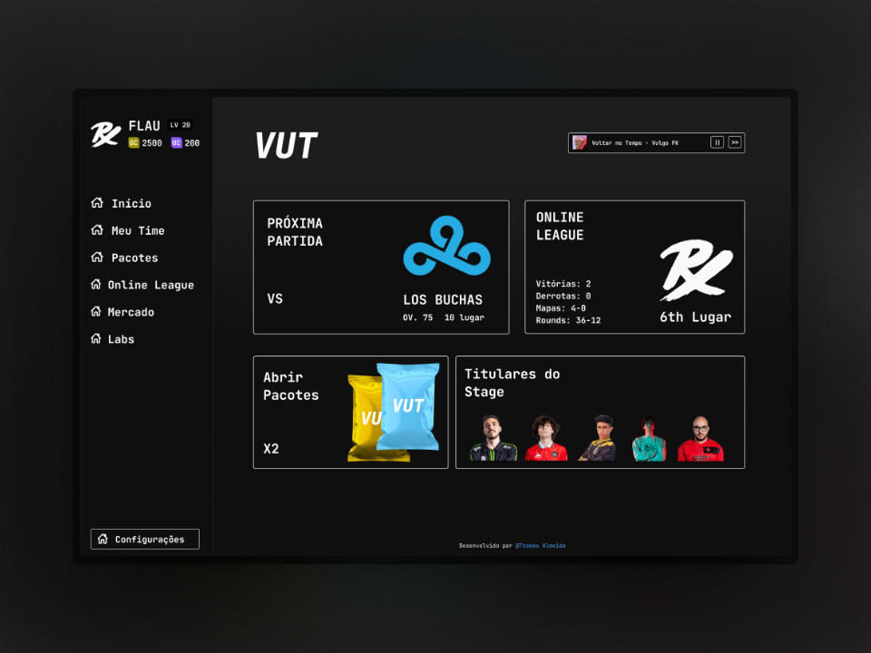

## VUT - VALORANT ULTIMATE TEAM

Projeto de card game que visa ser semelhante á ULTIMATE TEAM (FIFA) e FOOTBALL MANAGER, voltado para jogadores valorant.



> _disclaimer: este jogo é para fins de entretenimento e portfólio dos envolvidos._

### Contribua!
💻 Tecnologias usadas (por enquanto)

#### Hospedagens:
- Vercel: Frontend
- Render: Backend
#### Cheerio: para web scrapping do [vlr.gg]()
Todos os dados da nossa API foram formatados e compilados usando este site, infelizmente até onde vai meu conhecimento, nem eles nem a riot games possuem API's públicas para isso, então, criar uma api minha que compilasse os dados que eu precisava e achava ideiais para criar o game foi a única alternativa que encontrei, e claro uma ótima oportunidade de ganhar esse novo conhecimento.

### Instalação

Instalação das dependencias do Backend:
```terminal
  $ vut-cards/server npm install
```
Instalação das dependencias do Frontend
```terminal
  $ vut-cards/client npm install
```

### Proposta:

A ideia era ter um manager imersivo e simples de valorant, um card game que testasse hard-skils técnicas no desenvolvimento de uma aplicação ponta á ponta, de aprender a lidar com dependencias, lidar com usuários e seus fluxos, lidar com escalabilidade em produção, lidar com o marketing e captação e mostrar a recrutadores e outros desenvolvedores de nível similar que é possível construir um projeto que seja longevo, criado para um nicho de gosto e que pode render aprendizados unindo o útil ao agradável na profissão de desenvolvedor.

É claro, os usuários podem gostar do game ao ponto de pedirem mais features, construírem uma comunidade encima dele, repercurtir ao ponto de chamar atenção de figuras públicas criarem conteúdo sobre o projeto, e na real é realmente isso que almejo em partes, mas no cerne o que eu realmente quero é dar maior visibilidade ao meu portfólio e voltar ao mercado, seja com este projeto ou numa vaga comum numa empresa que enxerge valor no meu perfil.

### Mecanicas do VUT

#### Criando o time
Ao criar seu usuário no VUT, voce irá se deparar com as seguintes opções:
-  Escolher o nome do seu time
-  Escolher a região do pacote inicial;
-  Escolher dentre os simbolos roletados, quais dos emblemas seu time vai ter

Todos esses itens poderão ser vendidos depois para ganhar moedas para comprar mais pacotes e mais outros emblemas de times.

#### Pacotes
voce pode comprar novos pacotes com as modeas ganhas dentro do game as **Game Coins [GC]** e com as moedas que colocar usando dinheiro real as **Ultimate Coins [UC]**. A diferença entre as duas moedas é que com as **UC** é possível adquirir cosméticos para suas cartas, impulsionar jogadores mais rápido e comprar pacotes sazonais levemente impulsionados com cartas melhores, enquanto que com **GC** só é possível impulsionar jogadores e comprar pacotes dentro da loja.

O conteúdo de um pacote no game é em suma, apenas cartas com jogadores, existem também os pacotes de emblemas, tanto os pacotes de jogadores e emblemas tem seu valor relativo a raridade dos pacotes.

#### Coleção
No gerenciamento do time, voce pode montar seus titulares do stage para disputar a ONLINE LEAGUE, voce pode escolher dentre sua coleção de cartas que conseguiu adquirindo pacotes, quem jogará a próxima partida e quais dentre sua coleção ficarão na reserva.

#### Venda, reciclagem de jogadores e impulsos
Tirou um jogador repetido?, indesejado? sem problemas, no VUT voce pode vende-los e negociá-los no mercado livre, ou se quiser fazer aquela carta valer a pena, impulsioná-la no VUT LABS, nele voce pode impulsionar sua carta para melhorar os atributos dela e assim fazer aquela carta atingir maiores resultados no seu time e aumentar seu valor no mercado livre se desejar  vender mais caro. 

#### Partidas (recurso em desenvolvimento)
Ainda estamos analisando uma forma de criar um RNG que seja autosustentável e que seja de fácil entendimento para os usuários aprenderem a criar estratégias com suas cartas.

#### Online League (recurso em desenvolvimento)
A liga do game, uma liga geral com todos os players online do servidor do VUT, a online league servirá para que voce dispute partidas contra IA's usando os times titulares dos jogadores contra o seu time titular, nela voce ganha pontos de colocação para subir na tabela.

#### Músicas
Assim como nos games da EA, música nos menus gera uma forma de descontração no navegar da interface, queremos implementar essa mecanica também no VUT esperando que assim como nas músicas do FIFA, no VUT ela seja um plano de fundo na fluídez da usabilidade e experiencia do usuário.